# Procesverslag
Markdown is een simpele manier om HTML te schrijven.  
Markdown cheat cheet: [Hulp bij het schrijven van Markdown](https://github.com/adam-p/markdown-here/wiki/Markdown-Cheatsheet).

Nb. De standaardstructuur en de spartaanse opmaak van de README.md zijn helemaal prima. Het gaat om de inhoud van je procesverslag. Besteedt de tijd voor pracht en praal aan je website.

Nb. Door *open* toe te voegen aan een *details* element kun je deze standaard open zetten. Fijn om dat steeds voor de relevante stuk(ken) te doen.

## Jij

  
uitwerken voor kick-off werkgroep

  ### Auteur:
  Edward van Vliet

  #### Je startniveau:
  Blauw

  #### Je focus:
  Surface plane
 

## Je website

  
uitwerken vóór kick-off werkgroep

  ### Je opdracht:
  De homepagina van DigiD: https://www.digid.nl/

  #### Screenshot(s) van de eerste pagina (small screen): 
  Homepagina:   
     
  

  #### Screenshot(s) van de tweede pagina (small screen):
  Helpdesk:   
     
  
  

## Toegankelijkheidstest 1/2 (week 1)

  
uitwerken na test in 2e werkgroep

  ### Bevindingen
  Lijst met je bevindingen die in de test naar voren kwamen:
  Screenreader:
  + Headings worden goed opgeroepen door de Narrator. (+)
  + Links worden ook correct opgeroepen als je er doorheen tabt. (+)
  + De tekst wordt ook correct opgeroepen door de Narrator. (+)
  + Zoekbalk en invulveld gaat ook goed. (+)
  + De 'Helpdesk-pagina' (mijn tweede pagina) wordt ook goed opgeroepen. (+)
  - Het logo van de Rijksoverheid bovenin (in het midden) wordt overgeslagen door de Narrator, terwijl het icoontje linksboven wél wordt benoemd. Dit geldt zowel voor de Homepagina van DigiD, als voor de tweede pagina, de 'Helpdesk-pagina'. (-)
  - Scan mode: "Item heeft geen primary action." (-)
  - Link voor talen niet duidelijk: "Link NL" en "Link EN", voor beperkten onduidelijk dat het om de talen Nederlands en Engels gaat (toggle). Hier zou je eerder "Link taal website Nederlands" en/of "Link taal website Engels" voor willen horen. (-)
  - Heading levels onder de 'Manieren van inloggen-sectie' (op de homepagina), hier worden voor de Headings: DigiD App, Sms-controle, Gebruikersnaam en wachtwoord & Identiteitsbewijs, Heading level 6 gebruikt, terwijl in de footer ook Heading level 6 wordt gebruikt. Je zou hiervoor eerder de Heading level 3, 4 óf 5 gebruiken. (-)
  - De link (en logo) van DigiD naar de Play Store (onderin de Homepagina) wordt overgeslagen door de Narrator, alleen de links eronder worden opgenoemd, dit is niet heel essentieel omdat de link naar de Play Store ook rechtsonder in de afbeelding wordt opgeroepen. (-)
  - De icoontjes bij Telefoon, Contactformulier & X (Twitter) worden overgeslagen door de Narrator - zie Helpdesk-pagina (2e pagina). (-)

  

## Breakdownschets (week 1)

  
uitwerken na afloop 3e werkgroep

  ### de hele eerste pagina (Homepagina): 
  

  ### de hele tweede pagina (Helpdesk): 
  

  ### dynamisch deel (bijv. menu): 
  

## Voortgang 1 (week 2)

  
uitwerken voor 1e voortgang

  ### Stand van zaken
  Het opstellen van de HTML ging wel goed, alleen had ik een paar twijfelgevallen, namelijk of je een hr kunt gebruiken én wat te gebruiken bij een sluisteken (vertical bar):
  
  
  
  

  ### Agenda voor meeting
  Samen met je groepje opstellen:

  | Sten      | Melvin          | Edward    | Jesse        |
  | ---            | ---                | ---          | ---              |
  | HTML check  | Of de H1 in de header of de main moet komen wanneer deze verborgen is op de website             | Het in- en uitklappen van de navbar    | Wat wordt er van ons verwacht qua functionaliteiten zoals filters?    |
  | Dropdown | Of ik het logo van de website kan weergeven als de H1 | Of het toegestaan is om hr's te gebruiken in de html | ...              |
  | ...            | Een algemene check van de HTML én of de carrousels goed staan                | ...          | ...              |

  ### Verslag van meeting
  hier na afloop snel de uitkomsten van de meeting vastleggen

  - Naar beneden uitklappen met JavaScript óf met ::before & ::after
  - Navbar (hamburgermenu) met JavaScript - Toggle - ClassList-methode gebruiken
  - Geen hr's gebruiken! Geen enkele vorm van styling toegestaan in de HTML!
  - TranslateX(0) om het navigatiemenu te verbergen
  - Géén classes gebruiken voor "active" - op welke taal de pagina nu staat, dus NL of EN

## Voortgang 2 (week 3)

  
uitwerken voor 2e voortgang

  ### Stand van zaken
  Het main-gedeelte gaat de goede kant op en verder gaat de footer ook de goede kant op, onder andere met display: grid.
  Wat er fout gaat: een aantal afbeeldingen en iconen worden niet weergegeven op de website, zoals hieronder te zien is.
  Heeft dit dan te maken met de type afbeelding (webp, jpg, jpeg of png)?

  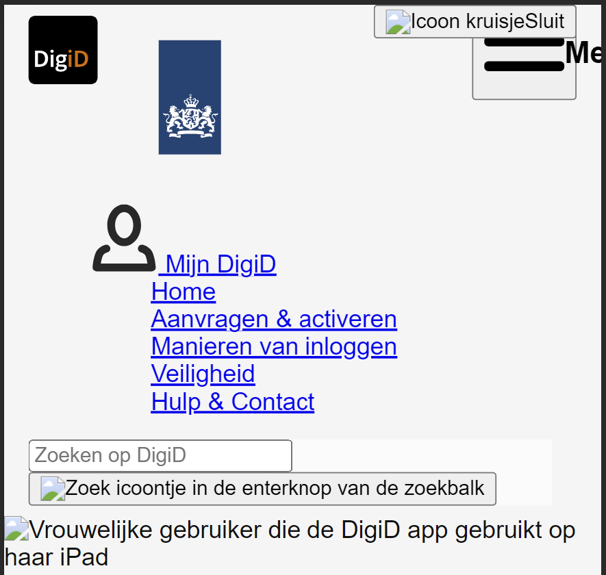
  
  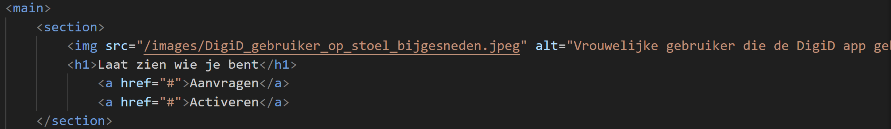
  

  Verder ben ik benieuwd hoe je een specifieke font (van je font-face) selecteert om te gebruiken in je CSS, als je er (zoals bij mijn geval) bijv. meerdere hebt.
  
  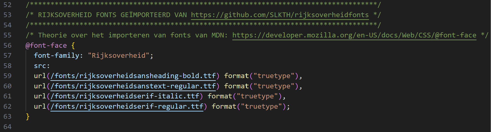

  ### Agenda voor meeting
  Samen met je groepje opstellen:

  | Sten      | Melvin          | Edward    | Jesse        |
  | ---            | ---                | ---          | ---              |
  | Het gebruik van webp i.p.v. png of jpg  | Hoe ik de tekst passend krijg binnen een carrousel (werkt nog niet goed) | Waarom sommige afbeeldingen/iconen bij mij niet worden weergegeven op de website | Benieuwd hoe ik de text dropdowns van mijn site het beste kan aanpakken |
  | Het juist croppen en schalen van img's | De content op de website van Nike wat nu live staat veranderd elke dag waardoor bepaalde afbeeldingen die ik nu toevoeg niet meer aansluiten op de eerder geschreven content. Wat raad je aan om te doen. | Hoe je een specifieke font (van je font-face) selecteert om te gebruiken in je CSS (als je er bijv. meerdere hebt) | ...              |
  | Bij een img, een layer naar achter plaatsen            | ...                | Tot slot een check naar de lay-out (CSS) van mijn header, omdat die nog niet helemaal wil lukken | ...              |
  | Het juist selecteren van de laatste a in section 3 voor styling           | ...                | ...              | ...              |

  ### Verslag van meeting
  hier na afloop snel de uitkomsten van de meeting vastleggen

  - Voor images handig -> max-width: 100%.
  - caniuse.com
  - flex-shrink:0;
  - ul li a {
      display: block;
    }
  - width: 100%;
  - height: 100%;
  - object-fit:cover; om de afbeelding binnen een vlak/section op te vullen (zonder de afbeelding uit te rekken of smaller te maken); 
  - object-position; om de positie te bepalen van je image bijvoorbeeld, zo kun je de focus leggen op een bepaalde deel van je afbeelding zonder te croppen;
  - ">" = Direct child selector!
  - Voor de img src="../images/afbeeldingnaam.jpeg" alt="Lorem ipsum" -> punt (.), punt (.), slash (/) gebruiken om de juiste "images-map" te selecteren.
    Let hierbij op de "../images/" voor de src (source).
    (Mappenstructuur, vanaf de root naar de uiteindelijke afbeelding, binnen(in) de "images-map".)
  - Bij sommige iconen, 'gewoon' de path-nummers uit de inspector van de originele DigiD website kopiëren.
    Hierdoor kun je ze ook van kleur veranderen bij het gebruik van een dark mode bijvoorbeeld.

## Toegankelijkheidstest 2/2 (week 4)

  
uitwerken na test in 9e werkgroep

  ### Bevindingen
  Lijst met je bevindingen die in de test naar voren kwamen (geef ook aan wat er verbeterd is):
  - De states bij "Manieren van inloggen"-section staan niet precies op hun plaats bij de links (de a's).
  - Gebruik aria-label(s) voor de screenreader, met name voor knoppen waarbij het voor de gebruiker onduidelijk is waarvoor de desbetreffende knop voor bedoeld is, waar ga je naartoe als gebruiker? (Feedforward!)
  - De states kunnen in de footer wat duidelijker qua kleurgebruik, zeker omdat de background-color van de footer vrij donker is (donkergrijs).
  - Een paar aria-labels missen nog, kan meteen worden toegevoegd in de HTML.
  - Het gebruik van de headings is beter dan de huidige website, daar sprongen ze namelijk van h2 naar h6 bijvoorbeeld.
  - Er is een hoog contrast kleurpalet toegevoegd (custom properties).

## Voortgang 3 (week 4)

  
uitwerken voor 3e voortgang

  ### Stand van zaken
  De afgelopen week verliep iets minder, ik was ziek, dus had de les over States gemist. Ook verschijnen mijn menu-items niet, nogal een raadsel waardoor dat komt. Verder wel wat vorderingen gemaakt aan mijn website.

  ### Agenda voor meeting
  Samen met je groepje opstellen:

  | Sten      | Melvin          | Edward    | Jesse        |
  | ---            | ---                | ---          | ---              |
  | Hoe zet ik het logo in het centrum van de knop?  | Ik heb een link wat een button moet zijn. Kan ik hiervoor een class gebruiken? Wat is het alternatief?            | Een algemene vraag over States, als je bijv. een link (a) stylet als button, of dan bijv. de visited state nog van toepassing is    | Is nog steeds benieuwd naar hoe je een text dropdown aanpakt    |
  | Waarom verschijnen mijn menu-items niet? | Voor de video met de pauze/play button heb ik een class en ID toegevoegd. Is dat oké? | Waarom mijn menu items (ook) niet verschijnen? | Heeft een vraag over het jatten van svg's |
  | Hoe zorg ik dat de gradient de tekst niet meeneemt en doorgaat tot het onderste van het kaartje?            | Hoe zorg ik ervoor dat de afbeeldingen in de carroussel meeschalen met de website (voor desktop)?                | Een tierelantijntje van DigiD nét boven de footer (donkerblauw vierkant vlakje in het midden), hoe ik die moet aanpakken in de HTML/CSS          | ...              |
  | Andere lelijkheidjes.            | ...                | Wat wordt er van je verwacht qua responsiveness, als je de surface plane (*bling bling) hebt gekozen?          | ...              |
  

  ### Verslag van meeting
  hier na afloop snel de uitkomsten van de meeting vastleggen

  - Voor JavaScript kan je id's gebruiken i.p.v. classes, als er écht geen optie is een class gebruiken.
  - Gebruik "truncate" (dropdown) - text-overflow.
  - Of gebruik "details" voor de dropdown.
  - Donkerblauwe vlak bij de footer -> "::before" gebruiken en dan ermee positioneren.

## Eindgesprek (week 5)

  
uitwerken voor eindgesprek

  ### Je uitkomst - karakteristiek screenshots:
  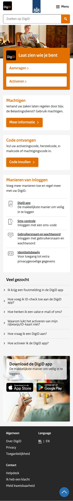

  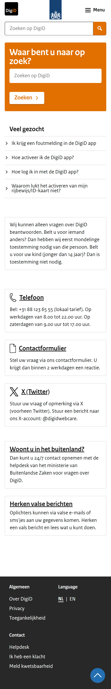

  
  

  ### Dit ging goed/Heb ik geleerd: 
  Ik heb deze periode van FED veel geleerd, hieronder een aantal punten op een rijtje.

  - Hoe je nette, semantische, 'clean' vanilla code kan schrijven;
    
  - Het beter begrijpen en toepassen van flexbox en grid in je CSS;
    
    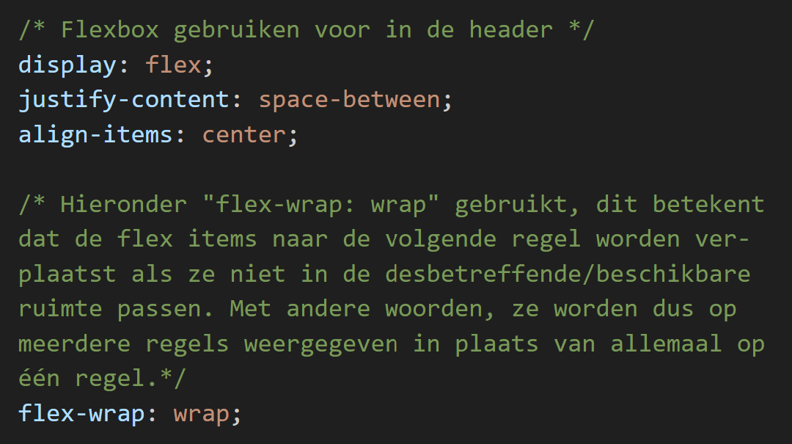

    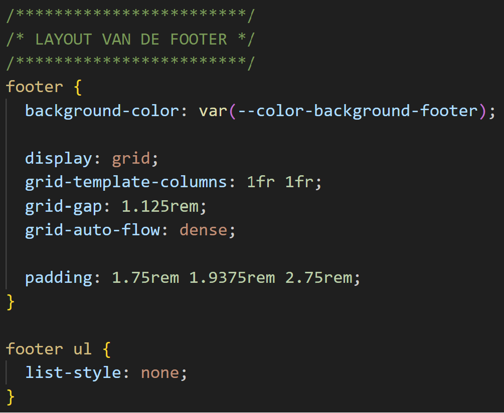
  
  - Het beter begrijpen van CSS Selectoren, ik was daar altijd vrij slecht is;
    
    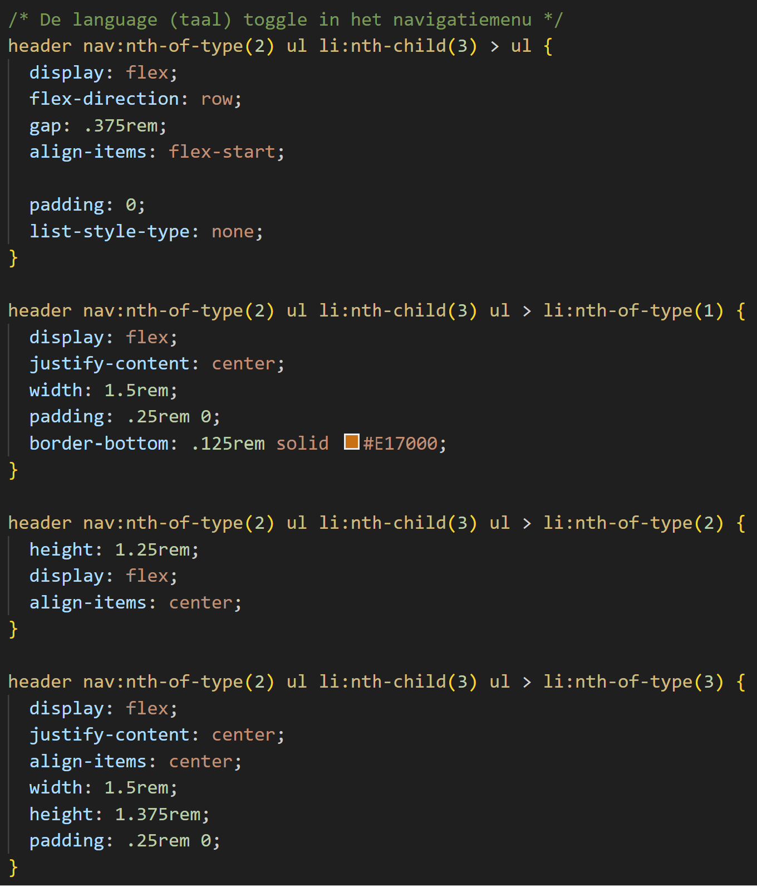
  
  - Het beter begrijpen van JavaScript, hoe je bijvoorbeeld een navigatiemenu in een knop kan verstoppen en hoe je die dan met JavaScript in- en uit kan klappen;
    
    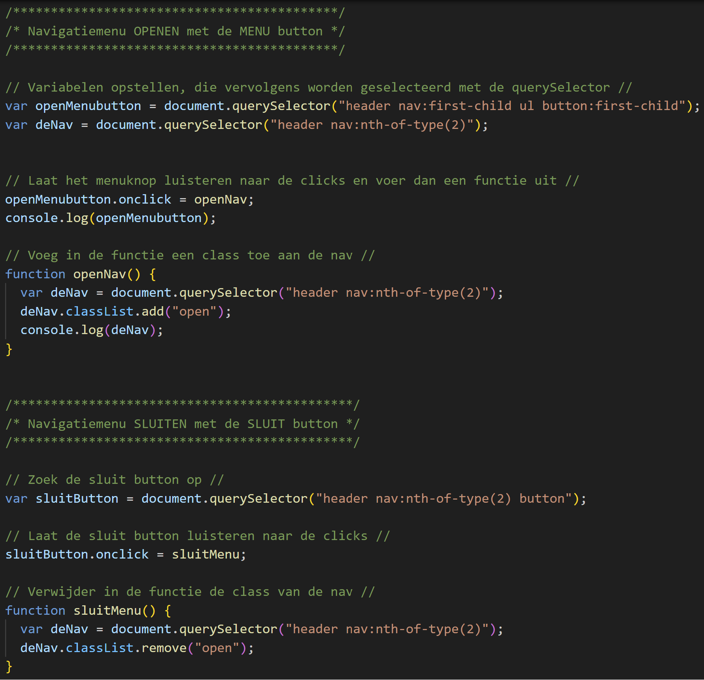
    
  - Dat toegankelijkheid ook heel erg belangrijk is bij het coderen/maken van je website (zelfs verplicht vanaf ingang 2025);
    
  - Hoe je aria-labels moet gebruiken voor de screenreader;
    
    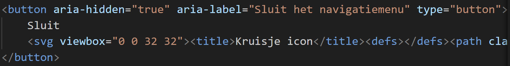
    

  ### Dit was lastig/Is niet gelukt:
  - Hoewel ik voor de surface plane ("bling bling") had gekozen, was ik eigenlijk ook van plan om het ook helemaal responsive te maken voor desktop én tablet.
  Maar helaas had ik daar geen tijd meer voor (met name voor de tablet-versie).
  Ik heb wél wat onderdelen voor de desktop resonsive kunnen maken, zoals de header, footer en wat een paar sections in de main.
  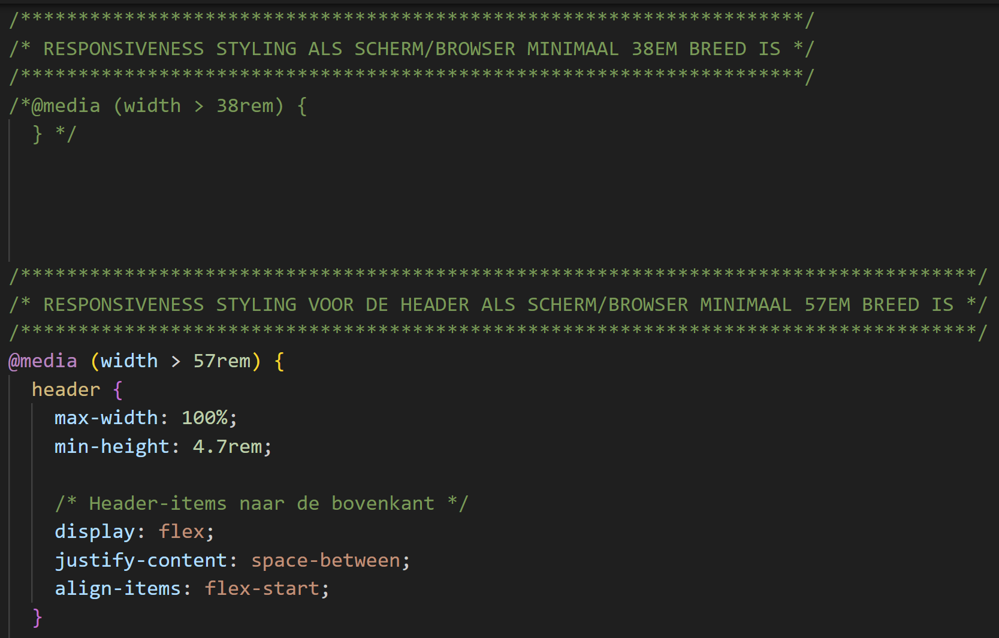

  - Qua states wilde ik eigenlijk ook specifieker per knop dieper op ingaan qua vormgeving met de verschillende hover, focus en active states.
  Uiteindelijk heb ik dat dus niet zo specifiek gedaan als ik had gewild.
  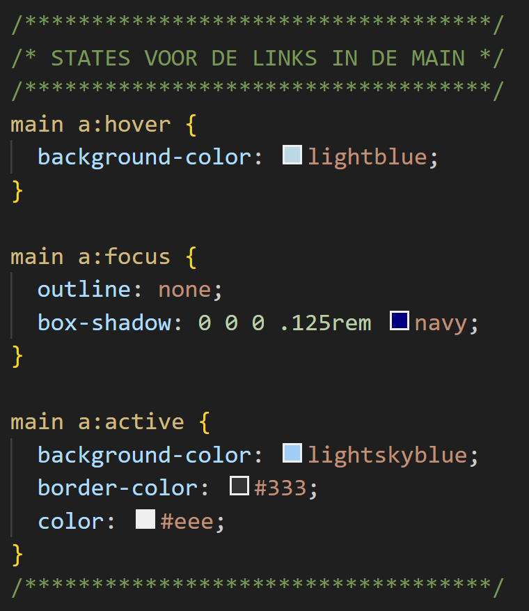

  - Tot slot een klein detailpunt, het is mij ook niet gelukt om het klein Rijksoverheid versierinkje (donkerblauw vlak) boven de footer te realiseren.
  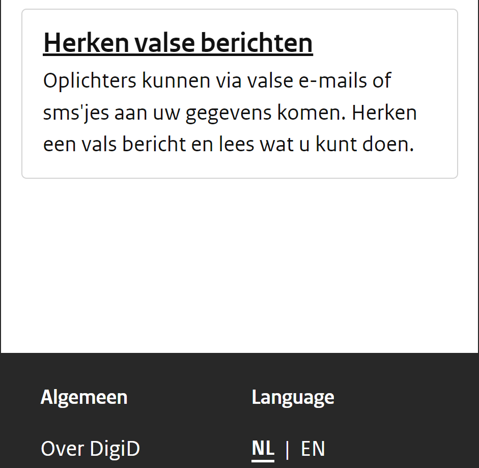

  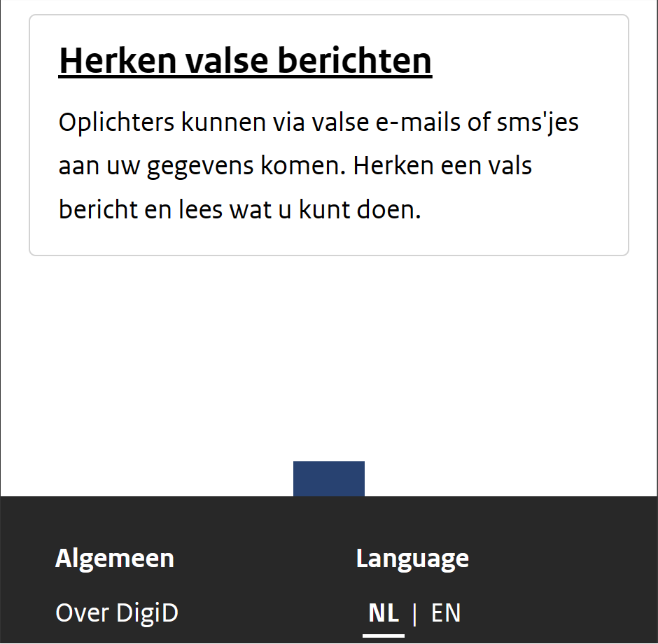
  

## Bronnenlijst

  
continu bijhouden terwijl je werkt

  Nb. Wees specifiek ('css-tricks' als bron is bijv. niet specifiek genoeg). 
  Nb. ChatGpT en andere AI horen er ook bij.
  Nb. Vermeld de bronnen ook in je code.

  1. [MDN: -webkit-text-stroke, voor Typografie oefening 2 (TRUMP VS BIDEN).](https://developer.mozilla.org/en-US/docs/Web/CSS/-webkit-text-stroke)
  2. [MDN: de transform function, translatex(0) om de navbar te verbergen.](https://developer.mozilla.org/en-US/docs/Web/CSS/transform-function/translateX)
  3. [Rijksoverheidfonts.](https://github.com/SLKTH/rijksoverheidfonts)
  4. [MDN: Font-face, fonts importeren.](https://developer.mozilla.org/en-US/docs/Web/CSS/@font-face)
  5. [MDN: Paths - SVG: Scalable Vector Graphics.](https://developer.mozilla.org/en-US/docs/Web/SVG/Tutorial/Paths)
  6. [CSS-tricks: How to create a skip to content link](https://css-tricks.com/how-to-create-a-skip-to-content-link/)
  7. Bron 7.
  8. ...

