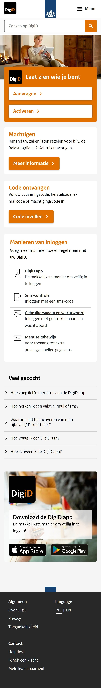
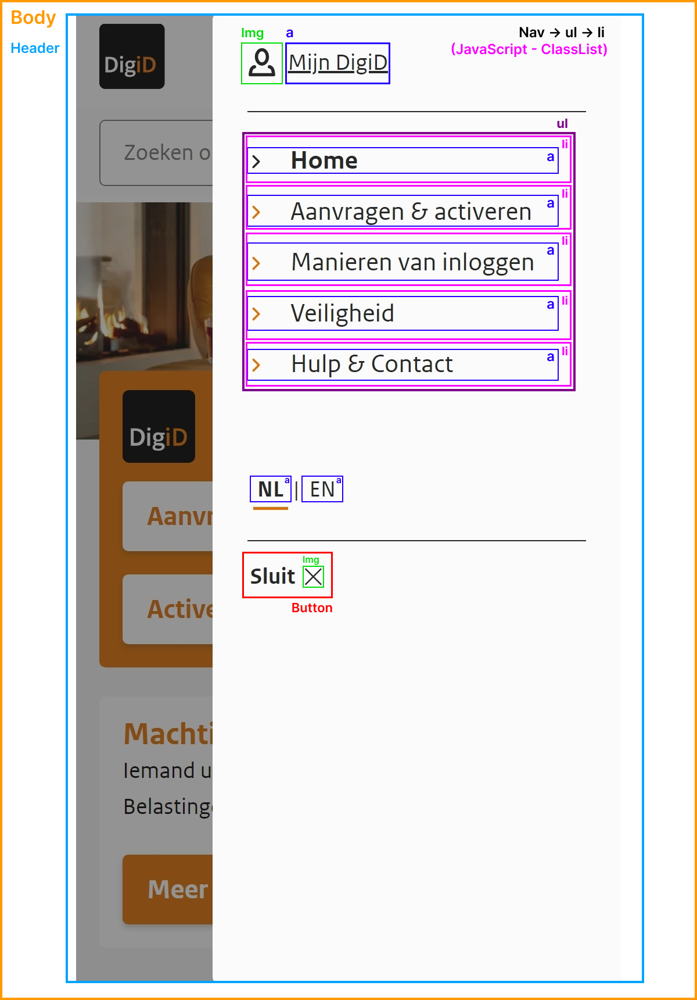

# Procesverslag
Markdown is een simpele manier om HTML te schrijven.  
Markdown cheat cheet: [Hulp bij het schrijven van Markdown](https://github.com/adam-p/markdown-here/wiki/Markdown-Cheatsheet).

Nb. De standaardstructuur en de spartaanse opmaak van de README.md zijn helemaal prima. Het gaat om de inhoud van je procesverslag. Besteedt de tijd voor pracht en praal aan je website.

Nb. Door *open* toe te voegen aan een *details* element kun je deze standaard open zetten. Fijn om dat steeds voor de relevante stuk(ken) te doen.

## Jij

  
uitwerken voor kick-off werkgroep

  ### Auteur:
  Edward van Vliet

  #### Je startniveau:
  Blauw

  #### Je focus:
  Surface plane
 

## Je website

  
uitwerken vóór kick-off werkgroep

  ### Je opdracht:
  De homepagina van DigiD: https://www.digid.nl/

  #### Screenshot(s) van de eerste pagina (small screen): 
  Homepagina:   
     
  

  #### Screenshot(s) van de tweede pagina (small screen):
  Helpdesk:   
     
  
  

## Toegankelijkheidstest 1/2 (week 1)

  
uitwerken na test in 2e werkgroep

  ### Bevindingen
  Lijst met je bevindingen die in de test naar voren kwamen:
  Screenreader:
  + Headings worden goed opgeroepen door de Narrator. (+)
  + Links worden ook correct opgeroepen als je er doorheen tabt. (+)
  + De tekst wordt ook correct opgeroepen door de Narrator. (+)
  + Zoekbalk en invulveld gaat ook goed. (+)
  + De 'Helpdesk-pagina' (mijn tweede pagina) wordt ook goed opgeroepen. (+)
  - Het logo van de Rijksoverheid bovenin (in het midden) wordt overgeslagen door de Narrator, terwijl het icoontje linksboven wél wordt benoemd. Dit geldt zowel voor de Homepagina van DigiD, als voor de tweede pagina, de 'Helpdesk-pagina'. (-)
  - Scan mode: "Item heeft geen primary action." (-)
  - Link voor talen niet duidelijk: "Link NL" en "Link EN", voor beperkten onduidelijk dat het om de talen Nederlands en Engels gaat (toggle). Hier zou je eerder "Link taal website Nederlands" en/of "Link taal website Engels" voor willen horen. (-)
  - Heading levels onder de 'Manieren van inloggen-sectie' (op de homepagina), hier worden voor de Headings: DigiD App, Sms-controle, Gebruikersnaam en wachtwoord & Identiteitsbewijs, Heading level 6 gebruikt, terwijl in de footer ook Heading level 6 wordt gebruikt. Je zou hiervoor eerder de Heading level 3, 4 óf 5 gebruiken. (-)
  - De link (en logo) van DigiD naar de Play Store (onderin de Homepagina) wordt overgeslagen door de Narrator, alleen de links eronder worden opgenoemd, dit is niet heel essentieel omdat de link naar de Play Store ook rechtsonder in de afbeelding wordt opgeroepen. (-)
  - De icoontjes bij Telefoon, Contactformulier & X (Twitter) worden overgeslagen door de Narrator - zie Helpdesk-pagina (2e pagina). (-)

  

## Breakdownschets (week 1)

  
uitwerken na afloop 3e werkgroep

  ### de hele eerste pagina (Homepagina): 
  

  ### de hele tweede pagina (Helpdesk): 
  

  ### dynamisch deel (bijv. menu): 
  

## Voortgang 1 (week 2)

  
uitwerken voor 1e voortgang

  ### Stand van zaken
  Het opstellen van de HTML ging wel goed, alleen had ik een paar twijfelgevallen, namelijk of je een hr kunt gebruiken én wat te gebruiken bij een sluisteken (vertical bar):
  
  
  
  

  ### Agenda voor meeting
  samen met je groepje opstellen

  | Sten      | Melvin          | Edward    | Jesse        |
  | ---            | ---                | ---          | ---              |
  | HTML check  | Of de H1 in de header of de main moet komen wanneer deze verborgen is op de website             | Het in- en uitklappen van de navbar    | Wat wordt er van ons verwacht qua functionaliteiten zoals filters?    |
  | Dropdown | Of ik het logo van de website kan weergeven als de H1 | Of het toegestaan is om hr's te gebruiken in de html | ...              |
  | ...            | Een algemene check van de HTML én of de carrousels goed staan                | ...          | ...              |

  ### Verslag van meeting
  hier na afloop snel de uitkomsten van de meeting vastleggen

  - Naar beneden uitklappen met JavaScript óf met ::before & ::after
  - Navbar (hamburgermenu) met JavaScript - Toggle - ClassList-methode gebruiken
  - Geen hr's gebruiken! Geen enkele vorm van styling toegestaan in de HTML!
  - TranslateX(0) om het navigatiemenu te verbergen
  - Géén classes gebruiken voor "active" - op welke taal de pagina nu staat, dus NL of EN

## Voortgang 2 (week 3)

  
uitwerken voor 2e voortgang

  ### Stand van zaken
  hier dit ging goed & dit was lastig (neem ook screenshots op van delen van je website en code)

  ### Agenda voor meeting
  samen met je groepje opstellen

  | Sten      | Melvin          | Edward    | Jesse        |
  | ---            | ---                | ---          | ---              |
  | dit bespreken  | en dit             | Waarom sommige afbeeldingen/iconen bij mij niet worden weergegeven op de website | Benieuwd hoe ik de text dropdowns van mijn site het beste kan aanpakken |
  | en dat ook nog | dit als er tijd is | Hoe je een specifieke font (van je font-face) selecteert om te gebruiken in je CSS (als je er bijv. meerdere hebt) | ...              |
  | ...            | ...                | Tot slot een check naar de lay-out (CSS) van mijn header, omdat die nog niet helemaal wil lukken | ...              |

  ### Verslag van meeting
  hier na afloop snel de uitkomsten van de meeting vastleggen

  - punt 1
  - punt 2
  - nog een punt
- ...

## Toegankelijkheidstest 2/2 (week 4)

  
uitwerken na test in 9e werkgroep

  ### Bevindingen
  Lijst met je bevindingen die in de test naar voren kwamen (geef ook aan wat er verbeterd is):

## Voortgang 3 (week 4)

  
uitwerken voor 3e voortgang

  ### Stand van zaken
  hier dit ging goed & dit was lastig (neem ook screenshots op van delen van je website en code)

  ### Agenda voor meeting
  samen met je groepje opstellen

  | Sten      | Melvin          | Edward    | Jesse        |
  | ---            | ---                | ---          | ---              |
  | dit bespreken  | en dit             | en ik dit    | en dan ik dat    |
  | en dat ook nog | dit als er tijd is | nog een punt | dit wil ik zeker |
  | ...            | ...                | ...          | ...              |

  ### Verslag van meeting
  hier na afloop snel de uitkomsten van de meeting vastleggen

  - punt 1
  - punt 2
  - nog een punt
  - ...

## Eindgesprek (week 5)

  
uitwerken voor eindgesprek

  ### Je uitkomst - karakteristiek screenshots:
  

  ### Dit ging goed/Heb ik geleerd: 
  Korte omschrijving met plaatjes

  

  ### Dit was lastig/Is niet gelukt:
  Korte omschrijving met plaatjes

  

## Bronnenlijst

  
continu bijhouden terwijl je werkt

  Nb. Wees specifiek ('css-tricks' als bron is bijv. niet specifiek genoeg). 
  Nb. ChatGpT en andere AI horen er ook bij.
  Nb. Vermeld de bronnen ook in je code.

  1. [MDN: -webkit-text-stroke, voor Typografie oefening 2 (TRUMP VS BIDEN).](https://developer.mozilla.org/en-US/docs/Web/CSS/-webkit-text-stroke)
  2. [MDN: de transform function, translatex(0) om de navbar te verbergen.](https://developer.mozilla.org/en-US/docs/Web/CSS/transform-function/translateX)
  3. [Rijksoverheidfonts.](https://github.com/SLKTH/rijksoverheidfonts)
  4. [MDN: Font-face, fonts importeren.](https://developer.mozilla.org/en-US/docs/Web/CSS/@font-face)
  5. Bron 5.

